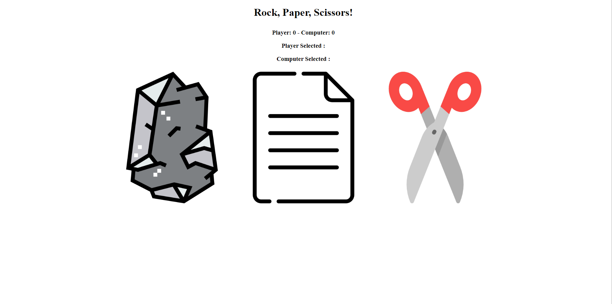

# Rock Paper Scissor Game

## Game made using HTML, CSS and JavaScript.  

click [here]( https://saeed7865.github.io/Digital-clock/) to view the digital clock.

### Summary
This is a simple game similar to the one we used to play as children with our hands called Rock paper scissors. Rounds are played by clicking
the objects and, scores are displayed above. Developing this project, I learned about switch cases and debugging which I believe will be very helpful in future programming.
### Author
- Osama Saeed Sandhu - Full stack developer - [Website]|[Linkedin]